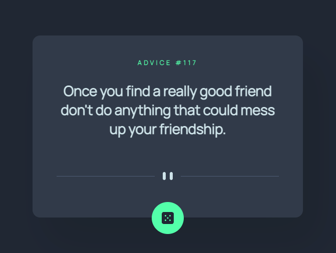

# Advice Generator

This is a solution to the [Advice generator app challenge on Frontend Mentor](https://www.frontendmentor.io/challenges/advice-generator-app-QdUG-13db). Frontend Mentor challenges help you improve your coding skills by building realistic projects.

## Table of contents

- [Advice Generator](#advice-generator)
  - [Table of contents](#table-of-contents)
    - [The challenge](#the-challenge)
    - [Screenshot](#screenshot)
    - [Links](#links)
    - [Built with](#built-with)

### The challenge

Users should be able to:

-   Click on the button and view new pieces of advice.

### Screenshot

### Links

-   [Solution](https://github.com/groverrichardson/advice-generator)
-   [Live Site](https://advice-generator-gilt.vercel.app/)

### Built with

-   Semantic HTML5 markup
-   SASS
-   jQuery
